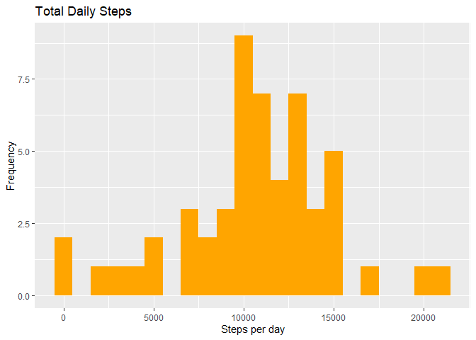
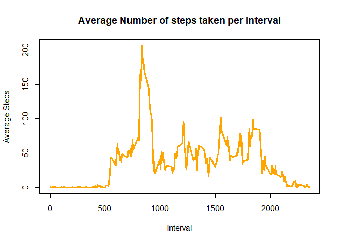
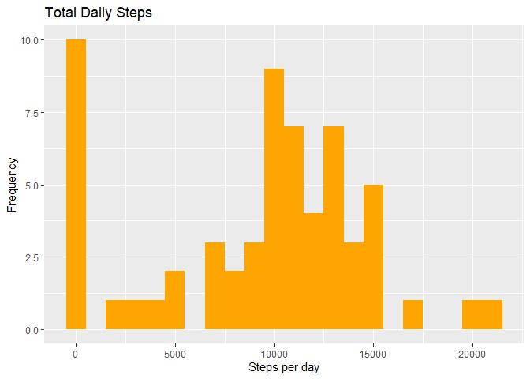
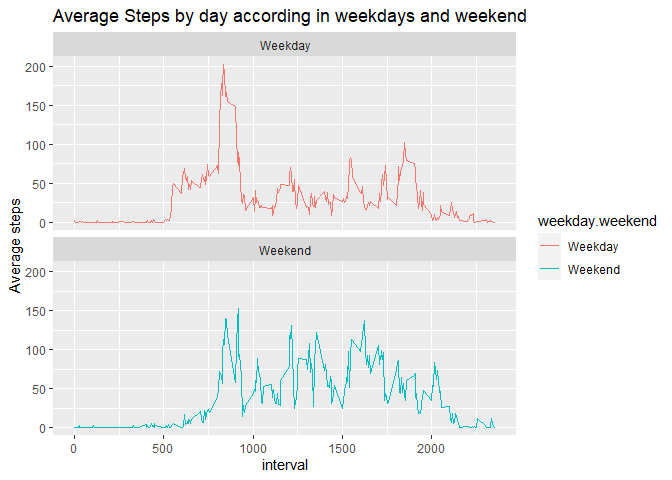

**Author:** Dan Morgenstern  
**Data Science Specialization in Coursera** - Johns Hopkins Univeristy

In the following document I will answer the questions posed on the assignment
instructions in Coursera on the data provided by activity monitors.

## Loading and preprocessing the data

First, we unzip and read the csv file into R.  
Also, we load the packages that we'll use and convert the date variable into a date object  

```r
library(dplyr)
library(knitr)
library(ggplot2)
library(imputeMissings)
unzip("activity.zip")
activity<- read.csv("activity.csv")
activity$date <- as.POSIXct(activity$date, "%Y-%m-%d")
```

## What is mean total number of steps taken per day?
1. Calculate the total number of steps taken per day

```r
Daily_steps<- with(activity, aggregate(steps, by = list(date), FUN = sum))

# Writing the column names of the new dataset

names(Daily_steps)<- c("Date", "Total_Daily_Steps")

#Confirming that the new dataset has the total daily steps

head(Daily_steps)
```

```
##         Date Total_Daily_Steps
## 1 2012-10-01                NA
## 2 2012-10-02               126
## 3 2012-10-03             11352
## 4 2012-10-04             12116
## 5 2012-10-05             13294
## 6 2012-10-06             15420
```

2. Make a histogram of the total number of steps taken each day


```r
ggplot(Daily_steps, aes(x = Total_Daily_Steps))+
      geom_histogram(fill = "orange", binwidth = 1000)+
      labs(title = "Total Daily Steps", x= "Steps per day", y= "Frequency")
```

<!-- -->

3. Calculate and report the mean and median of the total number of steps taken per day


```r
mean(Daily_steps$Total_Daily_Steps, na.rm = TRUE)
```

```
## [1] 10766.19
```

```r
median(Daily_steps$Total_Daily_Steps, na.rm = TRUE)
```

```
## [1] 10765
```

## What is the average daily activity pattern?

1. Make a time series plot of the 5-minute interval (x-axis) and the average number of steps taken, averaged across all days (y-axis)


```r
#Aggregate average steps per interval
Average_Daily_Pattern<- with(activity, aggregate(steps, by = list(interval), FUN = mean, na.rm = TRUE))
names(Average_Daily_Pattern)<- c("Interval", "Average_Steps")

#Making a time series plot
plot(Average_Daily_Pattern$Interval, Average_Daily_Pattern$Average_Steps, type = "l", col = "orange", xlab = "Interval", ylab = "Average Steps", main = "Average Number of steps taken per interval", lwd = 3)
```

<!-- -->

2. Which 5-minute interval, on average across all the days in the dataset, contains the maximum number of steps?


```r
Average_Daily_Pattern[which.max(Average_Daily_Pattern$Average_Steps), ]$Interval
```

```
## [1] 835
```

Interval #835 contains the maximum number of steps  

## Imputing missing values

Note that there are a number of days/intervals where there are missing values (coded as NA). The presence of missing days may introduce bias into some calculations or summaries of the data.

1. Calculate and report the total number of missing values in the dataset (i.e. the total number of rows with NAs)


```r
sum(is.na(activity$steps))
```

```
## [1] 2304
```

2. Devise a strategy for filling in all of the missing values in the dataset. The strategy does not need to be sophisticated. For example, you could use the mean/median for that day, or the mean for that 5-minute interval, etc.  
- I decided to use the median number of steps for that day in order to fill in the missing vaules
3. Create a new dataset that is equal to the original dataset but with the missing data filled in.


```r
activity_imputed<- impute(activity, method = "median/mode")
```


4. Make a histogram of the total number of steps taken each day and Calculate and report the mean and median total number of steps taken per day. Do these values differ from the estimates from the first part of the assignment? What is the impact of imputing missing data on the estimates of the total daily number of steps?


```r
Daily_steps_imputed <- with(activity_imputed, aggregate(steps, by = list(date), FUN = sum))
names(Daily_steps_imputed) <- c("Date", "Total_Daily_Steps")

#Plotting Histogram with imputed dataset

ggplot(Daily_steps_imputed, aes(x = Total_Daily_Steps))+
       geom_histogram(fill = "orange", binwidth = 1000)+
       labs(title = "Total Daily Steps", x= "Steps per day", y= "Frequency")
```

<!-- -->

```r
#Calculating the mean and median values for imputed values and comparing them with the original (non-imputed) values

mean(Daily_steps_imputed$Total_Daily_Steps, na.rm = TRUE) #Mean of imputed values
```

```
## [1] 9354.23
```

```r
mean(Daily_steps$Total_Daily_Steps, na.rm = TRUE) #Mean of original values
```

```
## [1] 10766.19
```

```r
median(Daily_steps_imputed$Total_Daily_Steps, na.rm = TRUE) #Median of imputed values
```

```
## [1] 10395
```

```r
median(Daily_steps$Total_Daily_Steps, na.rm = TRUE) #Median of original values
```

```
## [1] 10765
```

## Are there differences in activity patterns between weekdays and weekends?

1. Create a new factor variable in the dataset with two levels – “weekday” and “weekend” indicating whether a given date is a weekday or weekend day.


```r
activity_imputed$weekday.weekend <- sapply(activity_imputed$date, function(x) {
        if (weekdays(x) == "sábado" | weekdays(x) =="domingo") 
                {y <- "Weekend"} else 
                {y <- "Weekday"}
                y
        })
```
2. Make a panel plot containing a time series plot (type = "l") of the 5-minute interval (x-axis) and the average number of steps taken, averaged across all weekday days or weekend days (y-axis). 


```r
activity_imputed_weekdays<- aggregate(steps~interval + weekday.weekend, activity_imputed, mean)
ggplot(activity_imputed_weekdays, aes(x= interval, y= steps, color = weekday.weekend))+
        geom_line()+
        facet_wrap(~weekday.weekend, ncol = 1, nrow = 2)+
        labs(title = "Average Steps by day according in weekdays and weekend", x = "interval", y = "Average steps")
```

<!-- -->
